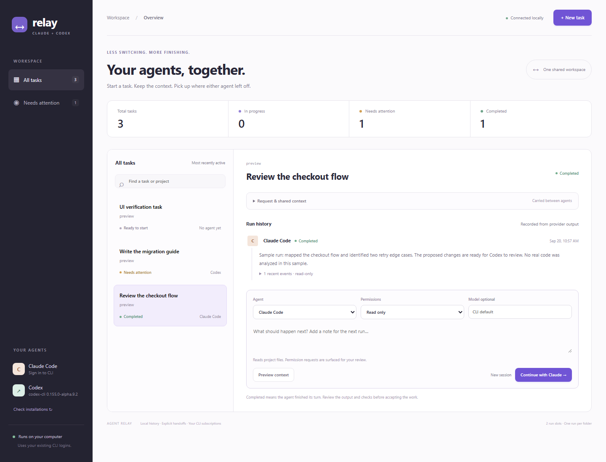

# Agent Relay

**Claude Code and Codex in one local workspace.** Start either agent, keep the request and context together, and hand work over without copying messages between windows.

[](https://github.com/CyberArchitecta/claude-codex-relay/actions/workflows/ci.yml)



Relay is an open-source local CLI with a browser interface. It uses your installed agent CLIs and their existing authentication. It does not provide model access or bundle a paid API proxy. MIT licensed, with no external runtime dependencies.


## Chat and usage

Click **New chat**, leave the project folder empty for a general conversation, and save it or include a first message. Choose Claude or Codex beside the message box. **Enter** sends; **Shift+Enter** adds a line. Switching providers forwards recent conversation history and shared context; returning to a provider resumes its saved session. You can attach a project when creating the chat, or choose **Project task** for the original coding workflow.

**Usage** shows recorded input/output/cache tokens for each provider. Each measured reply and conversation also shows token usage. Codex session counters are not counted twice on resume. Old or interrupted replies without usage are marked unreported. Claude's dollar amounts are CLI estimates, not subscription charges; Codex dollar cost is not guessed.

**Check Codex limits** reads your account's reported plan windows and reset times without calling a model. Claude's plan percentages are available through the linked usage page. Token volume, subscription percentages, and context-window fill are different measurements.

## Get started

Install **Node.js 24.13 or newer** and at least one current provider CLI:

- [Claude Code installation and login](https://code.claude.com/docs/en/quickstart)
- [Codex CLI installation and login](https://developers.openai.com/codex/cli/)

Then clone and run:

```sh
git clone https://github.com/CyberArchitecta/claude-codex-relay.git
cd claude-codex-relay
npm ci
npm run doctor
npm start
```

Open the private localhost URL printed in your terminal. Keep the terminal running. Ctrl+C stops Relay and the agent processes it launched.

Alternatively, install a versioned release without cloning:

```sh
npm install -g https://github.com/CyberArchitecta/claude-codex-relay/releases/download/v0.2.0/claude-codex-relay-0.2.0.tgz
agent-relay
```

This package is distributed through GitHub Releases; it is not published to the npm registry. Windows, macOS, and Linux use the same source package. There is no native desktop installer in this release.

## What it does

- **One task board:** see running, queued, completed, stopped, and interrupted tasks; filter work needing attention.
- **Launch either CLI:** stream structured events and preserve provider session IDs.
- **Resume:** continue the most recent run in the same agent's saved session.
- **Handoff:** switch agents with the original request, shared notes, recent instructions, agent reports, recorded command/file events, and current Git status. Preview the exact supplied context first.
- **Shared context:** edit decisions and constraints once; include them in subsequent runs.
- **Queue:** up to four concurrent projects; overlapping project folders run serially.
- **Local MCP bridge:** exchange messages between existing Claude/Codex clients at turn boundaries, and let them inspect Relay tasks or add context notes.

A completed run means the provider emitted completion and exited successfully. It does **not** mean tests passed or a human accepted the work. Events and summaries remain available for review.

## Typical workflow

1. Create a task with an absolute project folder, request, and any useful context.
2. Choose Claude Code or Codex. Start in **Read only**, or choose **Allow edits** for implementation.
3. Watch the run history. Relay records provider steps and reports limits, failures, and denials.
4. Add follow-up instructions to resume the same agent. Choose the other agent to hand off. Use **Preview context** to inspect what will be sent.
5. Review files and checks in the project. Relay does not commit, merge, or deploy on your behalf.

Tasks in the same or nested folders wait for one another. This only coordinates agents launched by this Relay server; unrelated terminal sessions can still edit those files. Use separate Git worktrees as project folders for parallel changes to one repository.

## Permissions and data

Read only uses Codex's read-only sandbox, or Claude's Read/Glob/Grep tools with unattended denial and external MCP disabled. Allow edits uses Codex's workspace-write sandbox or Claude's acceptEdits mode. Relay never enables the providers' bypass-permission flags. The providers' own configuration, hooks, and integrations still matter; Relay is not an operating-system security boundary. Shell commands Claude cannot approve appear as denied actions instead of being approved by Relay.

The dashboard listens only on `127.0.0.1`. All API requests require a random token, and foreign Host/Origin headers are rejected. The token is passed in the URL fragment, then kept in that browser tab's session storage. Restarting Relay rotates it. Do not share the private URL or proxy this server to the internet.

Relay stores prompts, shared context, run events, and summaries in `~/.claude-codex-relay/relay.sqlite3`. The compatible message bridge uses `~/.ai-bridge/messages.sqlite3`. Records stay on disk until you remove the data directory; there is no automatic retention policy or encryption at rest. Provider CLIs send prompts and relevant project information to their respective services as usual. Relay itself adds no cloud service, analytics, or telemetry.

## Use the bridge in existing clients

Print a configuration with paths resolved for your installation:

```sh
agent-relay config --agent claude
agent-relay config --agent codex
```

Add the generated server entry to each client's MCP configuration, using `claude` as the identity in Claude Code and `codex` in Codex. The Codex command also prints a TOML entry. [Detailed integration instructions](docs/integration.md).

The original bridge database format and five tools are preserved: `bridge_send`, `bridge_inbox`, `bridge_history`, `bridge_wait`, and `bridge_status`. New tools are `relay_tasks`, `relay_context`, and `relay_note`. Messages do not wake idle agents. There is no automatic chat-history merging or transcript import.

## Configuration

```sh
agent-relay --port 4317 --concurrency 2 --data-dir /path/to/relay-data
```

| Setting | Purpose |
| --- | --- |
| `RELAY_DATA_DIR` | Override Relay's data directory |
| `AI_BRIDGE_DATA_DIR` | Override the compatible bridge database directory |
| `RELAY_CLAUDE_BIN` | Absolute path to a Claude executable or JS entry point |
| `RELAY_CODEX_BIN` | Absolute path to a Codex executable or JS entry point |
| Model field in a task | Optional explicit model; blank preserves your CLI default |

On Windows, npm CLI shims are resolved to their JavaScript entry point and launched without a shell. A provider update that uses a different layout may require an explicit executable override.

Runs stop after 30 minutes or 20 MB of combined output. Restarted servers mark unfinished runs interrupted and require an explicit continuation; they do not silently restart work. Only one Relay server may own a data directory.

## Validation and current limits

From a source checkout:

```sh
npm test
npm run check
# Optional: invokes your authenticated providers and uses their allowance
node scripts/smoke-live.mjs
```

The fixture suite exercises subprocess streaming, session resume, cross-agent context, queue behavior, cancellation, message routing, persistence, and HTTP access controls. GitHub Actions runs it on Windows, macOS, and Linux. See [verification evidence](docs/verification.md) for actual results and the difference between fixture and live-provider checks.

This first release does not import existing terminal/app chats, automatically split a prompt into tasks, answer interactive permission dialogs, keep your computer awake, or run agents after shutdown. Handoffs use bounded text context and shared files; provider-internal conversation state is not transferred. Put durable requirements in shared context. It is a portable browser app rather than a native macOS app.

[Dervo research and scope comparison](docs/research.md) · [Security and privacy](SECURITY.md) · [Contributing](CONTRIBUTING.md) · [MIT license](LICENSE)
